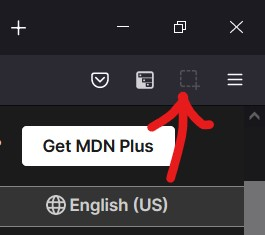
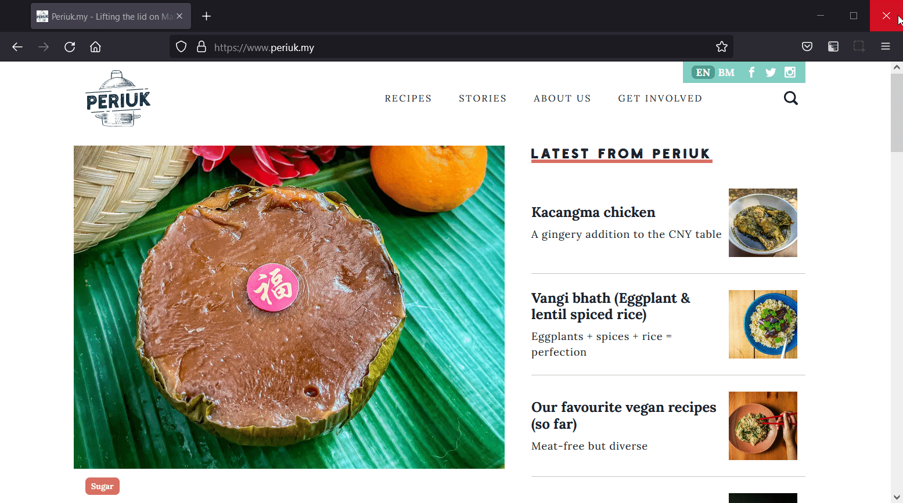

# websnap

Websnap is a Firefox extension which will take a screenshot of the entire page of a website (even content outside the viewport!). You can save the image in `png`, `jpeg`, and `gif` formats.

# Installation
Go to our Firefox add-on page [here](https://addons.mozilla.org/firefox/addon/websnapp/). Just click "Add to Firefox" and the installation will begin.

After the installation, you will see the extension in your Firefox toolbar.

 

Voilà! The installation is complete!

# Usage
To take a screenshot, click the extension icon in your toolbar.

At the new page, you can preview your screenshot or choose to save it in the format you desire.

# Support
[Open new issue](https://github.com/weiliang79/websnap/issues/new)

# Contributing
Please feel free to submit an issue or a pull request. To develop, you will need the Firefox web browser and a code editor.

# License
[MIT License]()
